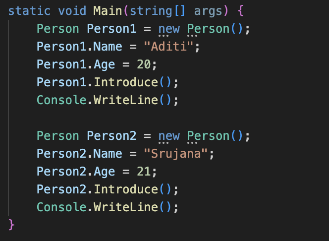

# TASK 2: **Simple Object-Oriented Programming (OOP)

## Requirments:
    - Create a `Person` class with properties and methods.
    - Define properties such as `Name` and `Age`.
    - Implement a method `Introduce()` that prints a personalized greeting.
    - Instantiate a few `Person` objects in your `Main` method and call `Introduce()` on each.

## Outputs:

### Objects defined:

### Introduce function:
