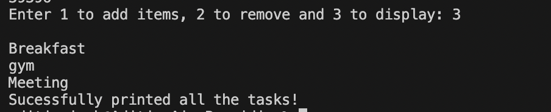
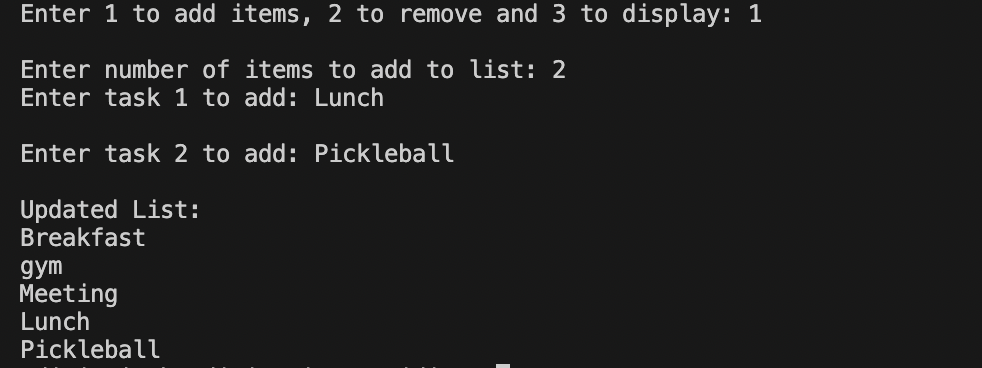
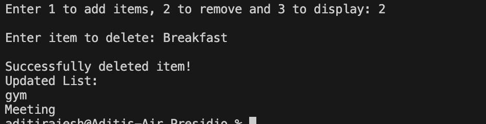

# TASK 3: 3. **Basic Collections and String Manipulation

## Requirements:
    - Write a program to manage a list of strings (e.g., names or tasks).
    - Use a `List<string>` to store items.
    - Allow the user to add, remove, and display items.
    - Utilize loops and basic string methods (like `Trim()`, `ToUpper()`) to process user input.

## Outputs:

### Display items:

### Add items:

### Delete items:
