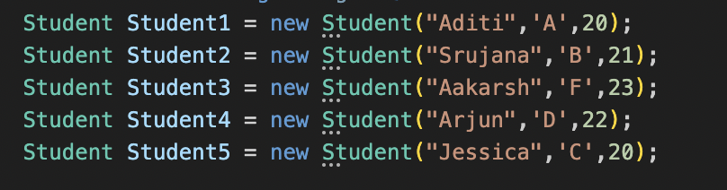
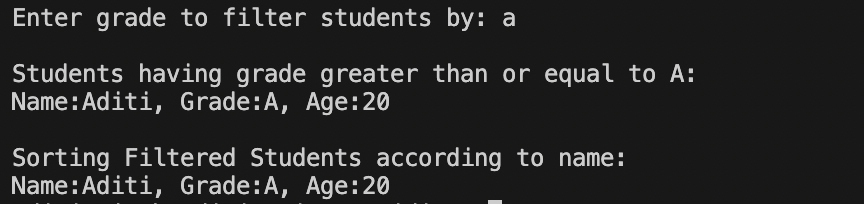
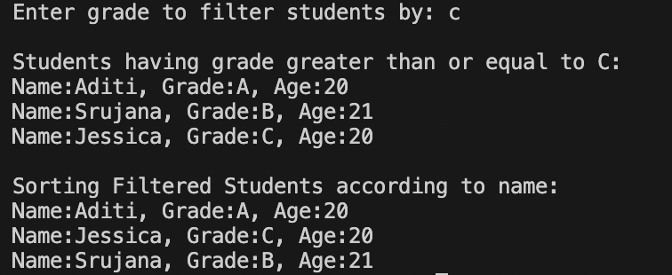

# TASK 4: 4. **Working with Collections and LINQ

## Requirements:
    - Create a student management console application.
    - Define a `Student` class with properties such as `Name`, `Grade`, and `Age`.
    - Populate a collection (e.g., a `List<Student>`) with sample data.
    - Use LINQ to:
        - Filter students who have a grade above a certain threshold.
        - Sort the filtered results by name or grade.
    - Display the filtered and sorted list.

## Outputs:

### List of student objects:

### Invalid grade input:

### Filter by Grade A:

### Filter by Grade C:
